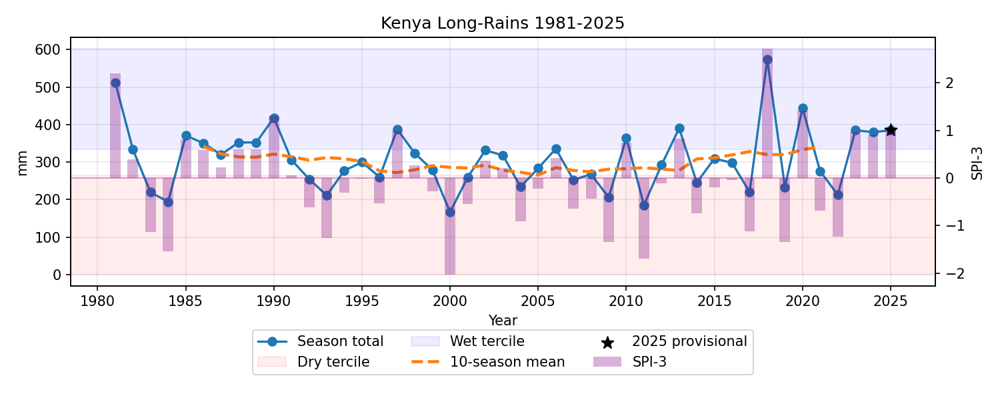

# Kenya Long-Rains ▸ ML-powered Climate Diagnostics 🌧️🔍  

This project is an end-to-end, fully reproducible pipeline that ingests CHIRPS satellite rasters, cleans and aggregates them into March-April-May (MAM) rainfall totals for Kenya, then applies statistical and machine-learning methods (SPI-3 drought index, ARIMA forecasting, K-means clustering, random-forest classification).  

A single CLI command handles everything—from raw GeoTIFF download to plotted insights—making it trivial to extend the workflow to any East-African country by only changing a bounding box.

## 🔑 Key features

| Module | What it does | Tech highlights |
|--------|--------------|-----------------|
| **1. Data ingest** | Downloads >130 monthly CHIRPS v3 files (or optional NASA POWER / ERA5-Land) | resilient retry & on-disk cache |
| **2. Pre-processing** | Raster → bbox clip → mm averages | `rasterio`, vectorised NumPy |
| **3. Climate indices** | SPI-3, %-of-normal, z-scores | Gamma fit with `scipy.stats` |
| **4. Forecasting** | ARIMA(1,0,0) + uncertainty ribbon | `statsmodels` |
| **5. Pattern mining** | K-Means clustering of MAM months | `scikit-learn` |
| **6. Classification** | Random-Forest predicts dry / normal / wet terciles | lag-features + grid-search |
| **7. Outputs** | PNG charts, CSV tables, pickled models | one-command reproducibility |

## 🚀 Quick start

### 1. clone and create a clean env (conda or venv)
pip install -r requirements.txt 

### 2. end-to-end run for Kenya 1981-2025
python east_africa_monsoon_project.py --run-all --start 1981 --end 2025

#### 🌍 Want Tanzania instead?
Just change the bounding-box (The ETL, SPI-3, clustering and plots adapt automatically):

python east_africa_monsoon_project.py --bbox -11.7 -0.9 29.3 40.4 --run-all
  

**Check out my blog post on: [Medium](https://medium.com/@sophiambataru/from-geotiffs-to-tidy-time-series-structuring-kenyas-long-rains-data-ee514f3a54f7)**
